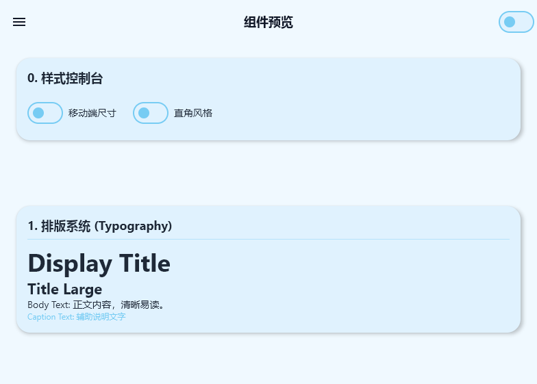
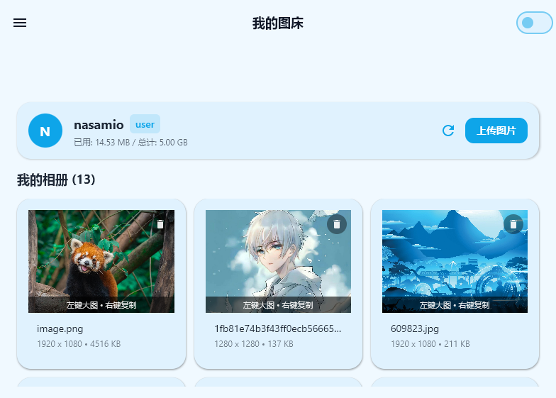
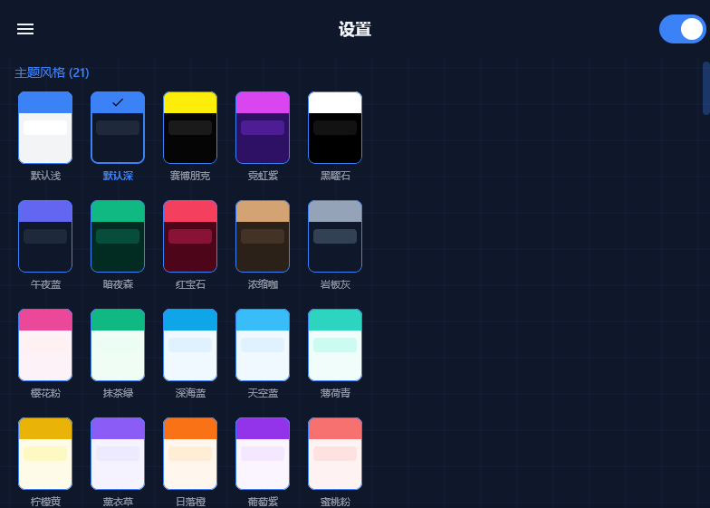
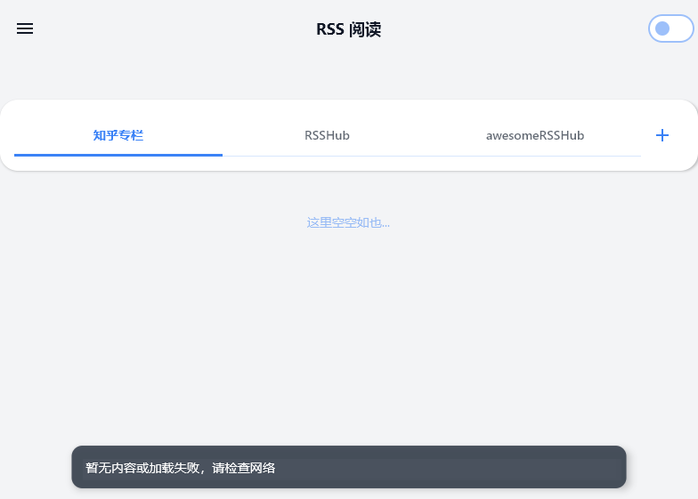

# MioLib 🚀


**MioLib** 是一个基于 **Kotlin Multiplatform (KMP)** 和 **Compose Multiplatform** 构建的现代化 UI 组件库与实用工具集。

它不仅包含一套完整且高度可定制的 UI 设计系统（支持 20+ 种预设主题），还集成了 **SM.MS 图床管理** 和 **RSS 阅读器** 功能，展示了 KMP 在桌面端和移动端跨平台开发的强大能力。

---

## ✨ 效果预览 (Demo)

### 🖥️ 桌面端演示


### 📱 界面截图

|          组件概览          |        主题切换        |       图床管理       |      RSS 阅读      |
| :------------------------: | :--------------------: | :------------------: | :-----------------: |
|  |  |  |  |

---

## 📦 模块结构

本项目采用多模块架构，职责清晰：

* **`:ui`** - 核心 UI 组件库
  * 提供 `MioButton`, `MioCard`, `MioInput`, `MioDialog` 等 30+ 个通用组件。
  * 内置 **MioTheme** 主题系统，支持动态切换浅色/深色模式及 21 种预设风格（如 Cyberpunk, Sakura, Obsidian 等）。
  * 包含 `MioGridBackground` 等炫酷的动态背景组件。
* **`:smms`** - 图床客户端模块
  * 封装 SM.MS API (V2)。
  * 支持图片上传、历史记录查看、删除、用户概览。
  * 使用 Ktor + Kotlinx.Serialization 处理网络请求。
* **`:rss`** - RSS 阅读模块
  * 支持 RSS 源订阅与解析。
  * 内置 XML 解析与 HTML 内容清洗逻辑。
  * 深度伪装 User-Agent 以绕过部分反爬策略。
* **`:demo`** - 演示工程 (Desktop)
  * 基于 Compose Desktop 的完整示例应用。
  * 集成上述所有模块，展示实际应用场景。

---

## 🛠️ 技术栈

* **语言**: Kotlin 2.0.0
* **UI 框架**: Jetpack Compose / Compose Multiplatform
* **网络**: Ktor 3.0.0 (CIO / OkHttp 引擎)
* **序列化**: Kotlinx Serialization
* **异步**: Kotlin Coroutines
* **构建**: Gradle Kotlin DSL

---

## 🚀 快速开始

### 环境要求

* JDK 17+
* IntelliJ IDEA / Android Studio

### 运行 Demo (桌面端)

在项目根目录下执行以下命令启动桌面版演示应用：

```bash
./gradlew :demo:run
```

### 项目使用

确保根目录的settings.gradle.kts有如下代码：

```
dependencyResolutionManagement {
		repositoriesMode.set(RepositoriesMode.FAIL_ON_PROJECT_REPOS)
		repositories {
			mavenCentral()
			maven { url = uri("https://jitpack.io") } // 添加这一行
		}
	}
```

ui库使用:

```
implementation("com.github.nasamio.MioLib:ui:1.0.3")
```

图床库使用：

```
implementation("com.github.nasamio.MioLib:smms:1.0.3")
```

## 核心代码示例

### 使用 MioTheme 和基础组件

```kotlin
MioTheme(style = MioThemeStyle.Cyberpunk) { // 一键切换赛博朋克主题
    MioScaffold(
        topBar = { MioTopBar("MioLib Demo") }
    ) { padding ->
        Column(modifier = Modifier.padding(padding)) {
            MioCard {
                MioText("Hello, World!", style = MioTheme.typography.titleLarge)
                Spacer(Modifier.height(8.dp))
                MioButton(
                    text = "点击我",
                    onClick = { /* Do something */ },
                    size = MioSize.Medium
                )
            }
        }
    }
}
```

### 调用 SM.MS 图床上传

```kotlin
val client = SmmsClient(token = "YOUR_API_TOKEN")
val response = client.uploadImage(
    fileName = "image.png",
    fileBytes = imageByteArray
)

if (response.success) {
    println("上传成功: ${response.data?.url}")
}
```

